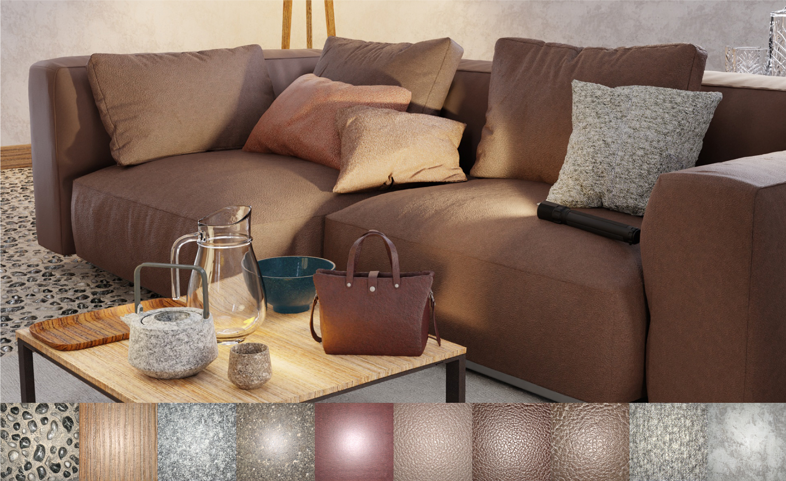

# PhotoMat: A Material Generator Learned from Single Flash Photos

This is code of "PhotoMat: A Material Generator Learned from Single Flash Photos" [Project](https://people.engr.tamu.edu/nimak/Papers/SIGGRAPH2023_PhotoMat/index.html) | [Paper](https://people.engr.tamu.edu/nimak/Papers/SIGGRAPH2023_PhotoMat/final_paper.pdf)



## Requirements

set up environments, please run below (tesed in Linux):

```
conda env create -f env.yml
```

## Sampling 

Please download pretrained model of from this [link](https://drive.google.com/file/d/1ji3y5GJEQpJLAJbxPdyJpSMPD4M2yhny/view?usp=sharing).

Inside the `model` folder, `G_#` is the generator, `MatUnet_#` is the maps estimator of `#`, which include 256x256, 512x512, 1kx1k and car models.

For sampling 256x256, 512x512, 1kx1k materials, please run this:


```

python material_sampler.py --network=$G_path --outdir=$out_path --matunet=$MatUnet_path --reload_modules=True --gpus=1 --out_nc=8 --seeds=10-50

```

Where `$G_path` is generator path, `$out_path` is output path, `$MatUnet_path` is the path of map estimator.


for car paint sampling, please run this:

```

python material_sampler.py --network=$G_path --outdir=$out_path --matunet=$MatUnet_path --reload_modules=True --gpus=1 --out_nc=11 --seeds=10-50 --carpaint=True

```

In the output folder, for each sample, we save relit materials of neural generation and analytic renderings under five different lightings, and the generated material maps.


## Dataset 

We release three datasets:

(1). A 2.5k 512x512 glossy dataset [link](), where the highlight is roughly centered for each example

(2). A small 512x512 car paint dataset [link]()

(3). 12k 2kx2k "in-the-wild" dataset [link](), where the json file contains the estimated position of each example


## Training

### First stage training

To train the 256x256 generator on dataset (1) or (2), please run this:

```
python train.py --outdir=$out_path --data=$data_path --gpus=8 --aug=noaug --batch 64 --deco_mlp 2 --d_res 256 --use_ray --no_cond_map --cdir_d=1 --load_real

```

To train the 512x512 or 1kx1k generator on dataset (3), please run this:

```
python train.py --outdir=$out_path --data=$data_path --gpus=8 --aug=noaug --batch 64 --deco_mlp 2 --d_res $res --use_ray --no_cond_map --cdir_d=1 --load_real --load_real_label

```
Where `$data_path` is training set path, `$out_path` is output path, `$res` control the resolution: 256 | 512 | 1024, `--circular` make output tileable (but only works well for 256x256 model so far); `--batch` control total batch size.


### Second stage training

We first run below script with `--force_shift=False` then finetune maps esimator with `--force_shift=True`

```
python material_trainer.py --network=$G_path --outdir=$out_path --reload_modules=True --gpus=1 --batch=4 --out_nc=8 --w_td=1 --w_dl1=0.1 --lr=1e-4 --light_type=pt --size=2 --li_range=0.5 --force_shift=True

```
Where `$li_range` control the sampled light range (default: 0.5), `--force_shift` shift materials during training every iterations


## Citation

If you find this work useful for your research, please cite:

```

@article{zhou2023photomat,
  title={PhotoMat: A Material Generator Learned from Single Flash Photos},
  author={Zhou, Xilong and Ha{\v{s}}an, Milo{\v{s}} and Deschaintre, Valentin and Guerrero, Paul and Hold-Geoffroy, Yannick and Sunkavalli, Kalyan and Khademi Kalantari, Nima},
  journal={arXiv e-prints},
  pages={arXiv--2305},
  year={2023}
}
```

## Contact

Please contact Xilong Zhou (1992zhouxilong@gmail.com) if there are any issues/comments/questions.

## License

Copyright (c) 2023, Xilong Zhou. 

All rights reserved.